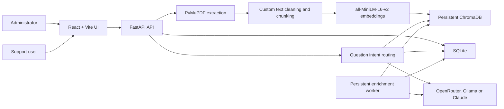
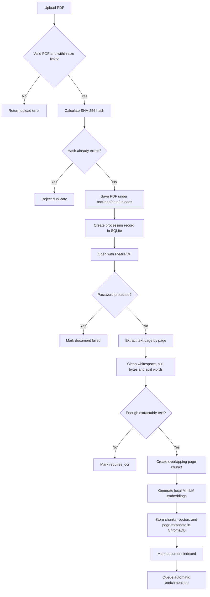
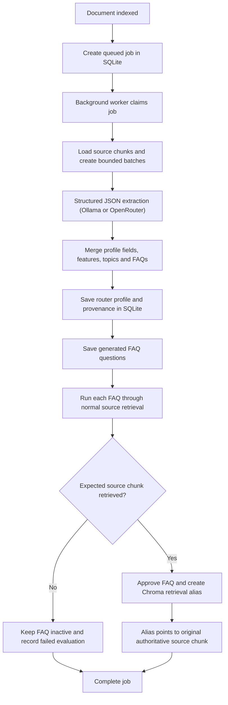
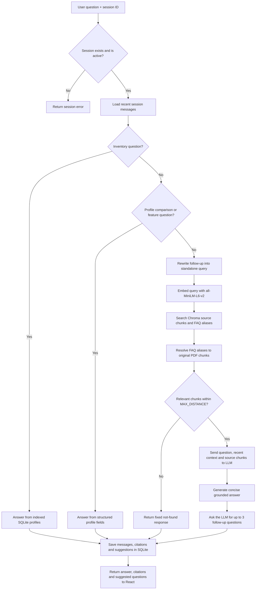

# Router Troubleshooting RAG

An internal router-support assistant that indexes PDF manuals and answers
questions from those manuals with page-level citations.

The project includes:

- A React and Vite administration/chat interface
- A FastAPI backend
- PDF extraction with PyMuPDF
- Local text embeddings with ChromaDB's `all-MiniLM-L6-v2`
- Persistent vector storage in ChromaDB
- Operational, conversation, profile, FAQ, and job data in SQLite
- OpenRouter (default), Ollama or Claude for query rewriting and grounded
  answer generation
- Automatic router-profile extraction and FAQ evaluation (Ollama or
  OpenRouter)
- Exact router model/product identifier filtering with safe global fallback
- Server-side document search, filtering, sorting and pagination
- Curated retrieval and answer evaluation datasets with CSV import/export
- Short-term, session-scoped conversation memory
- LLM-suggested follow-up questions after each grounded answer, persisted per
  message

The application is currently designed as a local Windows pilot. It has no
authentication and must not be exposed directly to the public internet.

## Table of contents

- [System architecture](#system-architecture)
- [How PDF indexing works](#how-pdf-indexing-works)
- [How automatic enrichment works](#how-automatic-enrichment-works)
- [How question answering works](#how-question-answering-works)
- [Conversation memory](#conversation-memory)
- [Technology stack](#technology-stack)
- [Data storage](#data-storage)
- [Local installation](#local-installation)
- [Configuration](#configuration)
- [Using the application](#using-the-application)
- [API reference](#api-reference)
- [Testing](#testing)
- [Troubleshooting](#troubleshooting)
- [Current limitations and production guidance](#current-limitations-and-production-guidance)

## System architecture



The main responsibilities are separated as follows:

| Component | Responsibility |
|---|---|
| React | PDF management, chat, citations, profile review and FAQ controls |
| FastAPI | HTTP APIs and orchestration |
| PyMuPDF | Extracting text from PDF pages |
| Custom chunker | Cleaning text and splitting it into overlapping chunks |
| `all-MiniLM-L6-v2` | Converting chunks and questions into 384-dimensional vectors |
| ChromaDB | Persistent semantic search and FAQ retrieval aliases |
| SQLite | Documents, sessions, messages, citations, profiles, FAQs and jobs |
| OpenRouter/Ollama/Claude | Follow-up rewriting, answer generation, and suggested follow-up questions |
| Enrichment worker | Automatic profile extraction, FAQ generation and evaluation (Ollama or OpenRouter) |

## How PDF indexing works

### Indexing flowchart



### 1. Upload validation

The frontend sends the selected file to:

```http
POST /api/documents
Content-Type: multipart/form-data
```

FastAPI receives it as an `UploadFile`. The backend:

1. Requires a `.pdf` filename.
2. Rejects empty uploads.
3. Enforces `MAX_UPLOAD_MB`.
4. Calculates a SHA-256 hash.
5. Rejects a file if that hash already exists.
6. Saves it with an internal UUID filename.

Original uploads are stored in:

```text
backend/data/uploads/
```

SQLite keeps both the original filename and the internal stored filename.

### 2. PDF text extraction

The project uses PyMuPDF:

```python
import fitz

document = fitz.open(path)
text = page.get_text("text")
```

Text is extracted separately for every page. Keeping page boundaries allows
the system to return citations such as:

```text
ASUS-AX1800-RT-AX52.pdf, page 4
```

Password-protected PDFs are rejected. Image-only or scanned PDFs usually do
not contain an extractable text layer; documents with fewer than
`MIN_EXTRACTED_CHARACTERS` are assigned the `requires_ocr` status.

OCR is not implemented in the current version.

### 3. Text cleaning

The custom cleaner:

- Replaces null characters
- Joins words broken across lines with a hyphen
- Collapses repeated spaces and tabs
- Reduces excessive blank lines

For example:

```text
trouble-
shooting
```

becomes:

```text
troubleshooting
```

### 4. Chunking

Each page is split independently using:

```dotenv
CHUNK_SIZE=900
CHUNK_OVERLAP=150
```

These values are character counts, not token counts.

The splitter initially targets 900 characters, then looks backward for a
sentence or line boundary. The next chunk begins 150 characters before the
previous chunk ended:

```text
Chunk 1: characters 0 -------------------------------- 900
Chunk 2:                         750 ------------------------------- 1650
                                 |-- 150-character overlap --|
```

Overlap reduces the chance of separating a troubleshooting action from its
condition or warning. Chunks never cross page boundaries.

Every chunk retains:

- Document ID
- Original filename
- Page number
- Chunk index
- Original chunk text

### 5. Local embeddings

The project creates embeddings through ChromaDB:

```python
from chromadb.utils.embedding_functions import DefaultEmbeddingFunction

embedding_function = DefaultEmbeddingFunction()
```

ChromaDB's default embedding function uses:

```text
all-MiniLM-L6-v2
```

Important properties:

- Runs locally through ONNX Runtime
- Produces a 384-dimensional vector
- Is used for both PDF chunks and user retrieval queries
- Does not send PDF text to MiniMax, Ollama Cloud, Claude or another embedding API

Example:

```text
"Hold the reset button for ten seconds."
                    |
                    v
[-0.0005, -0.0640, -0.0024, 0.0145, ... 384 values]
```

Semantically related text should produce nearby vectors even when the exact
wording differs.

The model is downloaded by ChromaDB to the user's cache, typically:

```text
C:\Users\<user>\.cache\chroma\onnx_models\all-MiniLM-L6-v2
```

### 6. ChromaDB storage

The application uses a persistent Chroma client:

```python
chromadb.PersistentClient(path="backend/data/chroma")
```

Source chunks are stored in the `router_manuals` collection with cosine
distance:

```python
metadata={"hnsw:space": "cosine"}
```

A conceptual source record looks like:

```json
{
  "id": "document-uuid:4:2",
  "document": "Hold the reset button for ten seconds.",
  "embedding": ["384 floating-point values"],
  "metadata": {
    "record_type": "source",
    "document_id": "document-uuid",
    "document": "router-manual.pdf",
    "page": 4,
    "chunk_index": 2
  }
}
```

The PDF is embedded only when it is uploaded or re-indexed. It is not
reprocessed for every question.

## How automatic enrichment works

Indexing makes unstructured PDF passages searchable. Enrichment additionally
extracts structured router information and generates retrieval test questions.

### Enrichment flowchart



### Persistent job processing

After a document reaches `indexed`, the backend creates an enrichment job in
SQLite. Upload does not wait for this work to finish.

The worker:

- Polls for queued jobs
- Claims one job transactionally
- Tracks progress from 0 to 100
- Retries failures up to three times
- Requeues jobs that were running when FastAPI stopped
- Avoids processing the same job twice

Configuration:

```dotenv
ENRICHMENT_ENABLED=true
ENRICHMENT_BATCH_CHARACTERS=6000
ENRICHMENT_POLL_SECONDS=2
```

### Structured profile extraction

The worker sends bounded groups of PDF chunks to the configured provider and
requests JSON-only output:

- **Ollama**: uses native JSON-schema constrained output (`format`) with
  `think: false`.
- **OpenRouter**: uses `response_format: {"type": "json_object"}` plus an
  explicit field list in the prompt, with lenient parsing/repair if the model
  wraps the JSON in markdown fences or extra text.
- **Claude**: not currently supported for enrichment; only used for chat
  query rewriting and answer generation.

Smaller/free-tier models (for example OpenRouter's `:free` models) can
truncate long JSON responses. If a response is cut off mid-object, the
enrichment job fails with an explicit "response was truncated" error instead
of silently producing partial data. Lowering `ENRICHMENT_BATCH_CHARACTERS` or
switching to a stronger model resolves this.

It requests:

- Router name
- Model
- Product ID
- Supported configuration
- Features
- Troubleshooting topics
- Field-level page/chunk provenance
- Three to eight likely FAQ questions

Unsupported fields must be returned as `null` or empty arrays. The worker
discards provenance and FAQs that reference a chunk ID not present in the
document.

### Editable profiles

Administrators can correct extracted fields in the React interface. Corrected
fields are marked as manual.

If enrichment is regenerated:

- New automatic extraction values are retained for audit
- Manual fields remain authoritative
- Non-manual fields are updated from the new extraction

Inventory and comparison questions use these profiles. If a router name has
not been extracted, the application derives a readable fallback from the PDF
filename.

### FAQ generation and evaluation

Generated FAQs are not stored as authoritative answers. Each FAQ contains:

- A question
- An expected troubleshooting topic
- A linked source chunk
- A source page and excerpt

The worker tests the FAQ using normal Chroma source retrieval with aliases
disabled. It passes only if the expected source chunk is retrieved within the
configured relevance threshold.

Passing FAQs are:

- Automatically approved
- Added to ChromaDB as `faq_alias` records

An alias contains the FAQ wording but points to an original source chunk. If a
user query matches an alias, the alias text is never sent to the answer model
as evidence. The system resolves it back to the linked PDF chunk and cites that
PDF page.

## How question answering works

### Question flowchart



### 1. Deterministic structured questions

Some questions should not depend on finding a sentence in a manual.

Examples:

```text
How many routers can we configure?
Which routers are available?
Compare the routers.
Which router supports Wi-Fi 7?
```

These are routed to SQLite profiles. This is faster and more reliable than
asking the LLM to infer the available document inventory.

An inventory response can look like:

```text
2 router setup guides are currently available:

1. ASUS AX1800
2. ASUS ROG AX6000

Which router are you asking about?
```

### 2. Follow-up rewriting

The backend loads up to `MEMORY_TURNS * 2` recent messages. If history exists,
the configured LLM rewrites the latest message into a standalone retrieval
query.

Example:

```text
User: How do I reset ASUS AX1800?
Bot: ...
User: What if it remains red?
```

Possible internal query:

```text
ASUS AX1800 red LED after reset
```

The rewritten query is used only for retrieval. A new search is performed for
every follow-up.

### 3. Semantic retrieval

ChromaDB embeds the rewritten query with the same `all-MiniLM-L6-v2` function
used for the PDF chunks.

Current defaults:

```dotenv
RETRIEVAL_TOP_K=5
MAX_DISTANCE=0.65
```

Chroma initially searches more records when FAQ aliases are enabled, resolves
aliases to source chunks, removes duplicates, sorts by distance and returns up
to `RETRIEVAL_TOP_K` passages.

Before global semantic search, the backend normalizes known router names,
models, product IDs, filenames and administrator aliases. Values such as
`RT-AX52`, `RT AX52` and `rtax52` normalize to the same identifier. If a query
contains a known identifier, ChromaDB is restricted to that document first. A
global fallback occurs only when strict retrieval produces no acceptable
passage. Retrieval diagnostics record the detected identifiers, matched
documents, candidate distances and whether fallback was required.

Smaller cosine distance means a stronger semantic match. Results above
`MAX_DISTANCE` are rejected.

### 4. Grounded answer generation

If passages are found, the configured LLM receives:

- The original question
- The standalone retrieval query
- Limited recent conversation context
- Retrieved PDF excerpts
- Source filenames and page numbers

It does not receive:

- The complete PDF
- Chroma embeddings
- Generated FAQ text as factual evidence
- Previous assistant answers as authoritative evidence

The system prompt requires the model to use only the supplied excerpts. If the
excerpts do not support an answer, it must respond:

```text
I could not find this in the uploaded router guide.
```

### 5. Suggested follow-up questions

After a grounded answer, the same provider is asked to propose up to three
short, practical follow-up questions based only on the retrieved excerpts and
the answer just given. Suggestions are skipped for not-found answers and for
deterministic inventory/profile answers.

Suggested questions are persisted with the assistant message (not just
returned for the live response), so they reappear when a chat session is
reloaded. Clicking a suggestion in the UI asks it immediately.

### 6. Citations and logging

The response includes:

- Answer text
- Grounded/not-found status
- Rewritten query, when applicable
- Source document
- Source page
- Supporting excerpt
- Retrieval distance
- Suggested follow-up questions
- Request ID

Citations are still computed, returned by the API, and stored in SQLite for
grounding and audit purposes, but the chat UI no longer renders them inline
under each answer — only the Evaluation workspace displays citation detail.

Messages, citations, suggested questions, total latency and errors are
persisted in SQLite.

## Conversation memory

Memory is session-scoped, not permanent user memory.

The application:

- Creates a UUID chat session
- Stores user and assistant messages in SQLite
- Loads a configurable number of recent turns
- Extends session expiry after activity
- Allows a user to start or clear a chat
- Deletes expired sessions when they are accessed

Configuration:

```dotenv
MEMORY_TURNS=5
SESSION_TTL_MINUTES=120
```

Conversation history helps resolve references such as “it,” “that router” and
“what next.” It is context only. Every troubleshooting question must still
retrieve fresh PDF evidence.

## Technology stack

### Backend

| Technology | Purpose |
|---|---|
| Python 3.11+ | Backend runtime |
| FastAPI | Typed HTTP API |
| Uvicorn | ASGI development server |
| Pydantic Settings | Environment configuration |
| PyMuPDF | PDF parsing and text extraction |
| ChromaDB | Persistent vector search |
| ONNX Runtime | Local MiniLM embedding inference |
| SQLite | Structured persistence |
| HTTPX | Ollama and OpenRouter HTTP API client |
| Anthropic SDK | Optional Claude provider |

Supported LLM providers (`LLM_PROVIDER`): `openrouter` (default), `ollama`,
`claude`.

### Frontend

| Technology | Purpose |
|---|---|
| React 18 | User interface |
| TypeScript | Type-safe frontend code |
| Vite | Development server and production build |
| Lucide React | Icons |
| Vitest | Component tests |
| Testing Library | UI interaction tests |

## Data storage

By default, runtime data is under:

```text
backend/data/
|-- rag.sqlite3
|-- uploads/
`-- chroma/
```

### SQLite

`rag.sqlite3` contains:

| Table | Contents |
|---|---|
| `documents` | Upload metadata, hashes, versions and processing statuses |
| `chat_sessions` | Session creation, activity and expiry |
| `messages` | User and assistant messages, plus persisted suggested follow-up questions |
| `citations` | Evidence attached to assistant messages |
| `question_logs` | Question, latency, retrieval result and error audit |
| `router_profiles` | Extracted and manually corrected structured facts |
| `generated_faqs` | Generated retrieval questions and source links |
| `faq_evaluations` | Retrieval pass/fail results and distances |
| `enrichment_jobs` | Persistent queue, attempts, progress and errors |

SQLite schema upgrades are additive and run when the backend starts.

### ChromaDB

ChromaDB stores two record types:

- `source`: authoritative PDF chunks
- `faq_alias`: approved questions that resolve to authoritative source chunks

Deleting a document removes its source vectors and aliases. Re-indexing
invalidates prior FAQs and evaluations while preserving manual profile fields.

## Local installation

### Prerequisites

- Windows PowerShell
- Python 3.11 or newer
- Node.js 20 or newer
- An OpenRouter API key (default provider), or Ollama, or an Anthropic API
  key

### 1. Create the Python environment

From the repository root:

```powershell
python -m venv .venv
.\.venv\Scripts\Activate.ps1
python -c "import sys; print(sys.executable)"
python -m pip install --upgrade pip
pip install -r backend\requirements.txt
```

The executable check should print a path inside:

```text
troubleshooter-guide\.venv\Scripts\python.exe
```

This check prevents accidentally using an unrelated virtual environment.

### 2. Create the environment file

```powershell
Copy-Item .env.example .env
```

Review `.env` before starting the backend.

### 3. Configure OpenRouter (default provider)

Create an API key at [openrouter.ai/keys](https://openrouter.ai/keys), then
set:

```dotenv
LLM_PROVIDER=openrouter
OPENROUTER_API_KEY=your-key
OPENROUTER_BASE_URL=https://openrouter.ai/api/v1
OPENROUTER_MODEL=nvidia/nemotron-3-nano-30b-a3b:free
OPENROUTER_TIMEOUT_SECONDS=120
```

OpenRouter is used for query rewriting, grounded answer generation, suggested
follow-up questions, and automatic knowledge enrichment.

Questions and retrieved PDF excerpts are sent to OpenRouter's hosted model.
Confirm company approval before sending internal manuals to a third-party
API, and note that free-tier models (`:free` suffix) can be less reliable at
producing well-formed structured JSON for enrichment than a paid model — see
[How automatic enrichment works](#how-automatic-enrichment-works).

### 4. Optional Ollama configuration

Install Ollama from [ollama.com/download](https://ollama.com/download) if you
prefer local inference instead of OpenRouter:

```dotenv
LLM_PROVIDER=ollama
OLLAMA_BASE_URL=http://localhost:11434
OLLAMA_MODEL=minimax-m2.5:cloud
```

Pull or register it:

```powershell
ollama pull minimax-m2.5:cloud
ollama list
```

The model name in `OLLAMA_MODEL` must exactly match a name shown by
`ollama list`.

For fully local inference, select a locally installed model such as:

```dotenv
OLLAMA_MODEL=qwen3.5:4b
```

The adapter sends `think: false`, which prevents thinking-capable models from
consuming their entire output budget before producing a final answer.

Ollama Cloud models can send the question and retrieved PDF excerpts outside
the local machine. Confirm company approval before using internal manuals with
a cloud model.

For a remote Ollama endpoint:

```dotenv
OLLAMA_BASE_URL=https://ollama.com
OLLAMA_API_KEY=your-key
```

### 5. Optional Claude configuration

Claude remains available for normal query rewriting and answer generation:

```dotenv
LLM_PROVIDER=claude
ANTHROPIC_API_KEY=your-key
CLAUDE_MODEL=claude-3-5-haiku-latest
```

Automatic knowledge enrichment does not support the Claude provider; use
`openrouter` or `ollama` if you need enrichment.

### 6. Start the backend

From the repository root (this matters — `DATA_DIR=backend/data` in `.env`
is relative, so starting Uvicorn from inside `backend/` instead would create
a stray `backend/backend/data` folder and a second, disconnected database):

```powershell
.\.venv\Scripts\Activate.ps1
python -m uvicorn app.main:app --reload --app-dir backend
```

Using `python -m uvicorn` ensures Uvicorn is loaded from the active project
environment.

Backend URLs:

- API: `http://localhost:8000`
- OpenAPI UI: `http://localhost:8000/docs`
- Health: `http://localhost:8000/api/health`

Example healthy response:

```json
{
  "status": "ok",
  "database": true,
  "vector_store": true,
  "embedding_model": true,
  "llm_provider": "openrouter",
  "llm_configured": true,
  "llm_available": true
}
```

### 7. Start the frontend

In a second PowerShell terminal:

```powershell
Set-Location frontend
npm install
npm run dev
```

Open:

```text
http://localhost:5173
```

Vite proxies `/api` requests to `http://localhost:8000`.

## Configuration

The complete default configuration is:

```dotenv
LLM_PROVIDER=openrouter
OPENROUTER_API_KEY=
OPENROUTER_BASE_URL=https://openrouter.ai/api/v1
OPENROUTER_MODEL=nvidia/nemotron-3-nano-30b-a3b:free
OPENROUTER_TIMEOUT_SECONDS=120

OLLAMA_BASE_URL=http://localhost:11434
OLLAMA_MODEL=minimax-m2.5:cloud
OLLAMA_API_KEY=
OLLAMA_TIMEOUT_SECONDS=120

ANTHROPIC_API_KEY=
CLAUDE_MODEL=claude-3-5-haiku-latest

DATA_DIR=backend/data
CHROMA_COLLECTION=router_manuals

CHUNK_SIZE=900
CHUNK_OVERLAP=150
RETRIEVAL_TOP_K=5
MAX_DISTANCE=0.65

MEMORY_TURNS=5
SESSION_TTL_MINUTES=120

MAX_UPLOAD_MB=25
MIN_EXTRACTED_CHARACTERS=80

ENRICHMENT_ENABLED=true
ENRICHMENT_BATCH_CHARACTERS=6000
ENRICHMENT_POLL_SECONDS=2

FRONTEND_ORIGINS=http://localhost:5173
```

| Setting | Meaning |
|---|---|
| `LLM_PROVIDER` | `openrouter` (default), `ollama`, or `claude` |
| `OPENROUTER_API_KEY` | OpenRouter API key |
| `OPENROUTER_BASE_URL` | OpenRouter API base URL |
| `OPENROUTER_MODEL` | Exact OpenRouter model slug (used for chat and enrichment) |
| `OPENROUTER_TIMEOUT_SECONDS` | Request timeout for generation |
| `OLLAMA_BASE_URL` | Ollama server URL |
| `OLLAMA_MODEL` | Exact Ollama model name |
| `OLLAMA_TIMEOUT_SECONDS` | Request timeout for generation |
| `DATA_DIR` | SQLite, upload and Chroma parent directory (relative to the process's working directory — always start the backend from the repository root) |
| `CHROMA_COLLECTION` | Vector collection name |
| `CHUNK_SIZE` | Approximate characters per source chunk |
| `CHUNK_OVERLAP` | Repeated characters between adjacent chunks |
| `RETRIEVAL_TOP_K` | Maximum source passages returned |
| `MAX_DISTANCE` | Maximum accepted cosine distance |
| `MEMORY_TURNS` | Recent user/assistant turn pairs retained for context |
| `SESSION_TTL_MINUTES` | Chat inactivity expiry |
| `MAX_UPLOAD_MB` | Maximum accepted PDF size |
| `MIN_EXTRACTED_CHARACTERS` | Minimum text required before OCR is necessary |
| `ENRICHMENT_ENABLED` | Enable automatic profiles and FAQ generation |
| `ENRICHMENT_BATCH_CHARACTERS` | Maximum chunk text per extraction request |
| `ENRICHMENT_POLL_SECONDS` | Worker delay when no job is available |
| `FRONTEND_ORIGINS` | Comma-separated CORS origins |

Changing the embedding model or collection schema requires re-indexing all
documents. Changing the answer model does not require re-indexing.

## Using the application

### Upload and indexing

1. Select **Upload PDF manual**.
2. Choose a text-based router PDF.
3. Wait for the document status to become **Ready**.
4. Automatic enrichment continues in the background.

Possible document statuses:

| Status | Meaning |
|---|---|
| `processing` | PDF extraction or vector indexing is running |
| `indexed` | Source chunks are available for retrieval |
| `requires_ocr` | Too little text was extracted |
| `failed` | Parsing, embedding or indexing failed |

Possible enrichment statuses:

| Status | Meaning |
|---|---|
| `not_started` | No job exists |
| `queued` | Waiting for the worker |
| `running` | Extraction/evaluation is running (Ollama or OpenRouter) |
| `ready` | Profile and FAQ evaluation completed |
| `failed` | Retry limit was exhausted |

### Search and filter documents

The document sidebar performs debounced server-side searches across filenames,
router names, models, product IDs and identifier aliases. Filters are available
for document status, enrichment status, features and topics. Results are sorted
and paginated with 25 records per page by default.

SQLite FTS5 is used when available; the backend falls back to normalized
`LIKE` queries on SQLite builds without FTS5.

### Run a curated evaluation

Open **Evaluation workspace** to:

1. Create or select a dataset.
2. Add supported or unsupported real support questions.
3. Assign the expected document and optional page range.
4. Add a topic, reference answer and pipe-separated required key points.
5. Import or export the same fields as CSV.
6. Queue a persistent evaluation run.

Runs exercise production identifier detection, strict retrieval, global
fallback, FAQ alias resolution and answer generation. They record top-1/top-3
accuracy, optional page accuracy, citation correctness, unsupported-question
refusal, key-point coverage, latency and an advisory LLM-judge score.

The deterministic pass gate is:

- At least 90% top-3 retrieval accuracy
- At least 95% citation/refusal correctness

The LLM judge is advisory and never changes pass/fail.

### Review generated knowledge

Expand a document in the sidebar to:

- See enrichment progress and errors
- Review the extracted router profile
- Inspect field provenance and page excerpts
- Correct profile values
- See generated FAQs and evaluation distances
- Enable or disable an FAQ retrieval hint
- Regenerate knowledge without re-indexing the PDF

### Ask questions

The chat supports:

- Direct troubleshooting questions
- Follow-ups that depend on recent context
- Router inventory questions
- Feature lookups
- Router comparisons
- Clickable suggested follow-up questions after each grounded answer

Citations are still generated and stored for every grounded answer (visible
via the API and the Evaluation workspace) but are not rendered inline in the
chat UI.

Starting a new chat deletes the prior session from SQLite and creates a new
session ID.

### Re-index

Re-indexing:

1. Cancels active enrichment work.
2. Removes existing Chroma records for the document.
3. Re-extracts and re-embeds the stored PDF.
4. Invalidates generated FAQs and evaluations.
5. Queues new enrichment.
6. Preserves administrator-edited profile fields.

### Delete

Deleting a document removes:

- Uploaded PDF
- Document metadata
- Source vectors
- FAQ aliases
- Router profile
- Generated FAQs
- Evaluations
- Enrichment jobs

## API reference

### Documents and knowledge

| Method | Path | Purpose |
|---|---|---|
| `POST` | `/api/documents` | Upload, extract, chunk and index a PDF |
| `GET` | `/api/documents` | Search/filter paginated document summaries |
| `POST` | `/api/documents/{id}/reindex` | Rebuild vectors and queue enrichment |
| `DELETE` | `/api/documents/{id}` | Remove document and all derived data |
| `GET` | `/api/documents/{id}/knowledge` | Read profile, FAQs, evaluations and latest job |
| `PATCH` | `/api/documents/{id}/profile` | Save administrator profile corrections |
| `POST` | `/api/documents/{id}/enrich` | Queue or return the current active enrichment job |
| `PATCH` | `/api/documents/{id}/faqs/{faq_id}` | Approve and activate/deactivate a retrieval alias |

### Chat

| Method | Path | Purpose |
|---|---|---|
| `POST` | `/api/chat/sessions` | Create a session |
| `GET` | `/api/chat/sessions/{id}/messages` | Load recent session messages |
| `DELETE` | `/api/chat/sessions/{id}` | Clear a session |
| `POST` | `/api/ask` | Ask a grounded question |

### Evaluation

| Method | Path | Purpose |
|---|---|---|
| `GET/POST` | `/api/evaluation/datasets` | List or create datasets |
| `GET/PATCH/DELETE` | `/api/evaluation/datasets/{id}` | Read, edit or delete a dataset |
| `POST` | `/api/evaluation/datasets/{id}/questions` | Add a benchmark question |
| `PATCH/DELETE` | `/api/evaluation/questions/{id}` | Edit or delete a question |
| `POST` | `/api/evaluation/datasets/{id}/import` | Validate and import CSV questions |
| `GET` | `/api/evaluation/datasets/{id}/export` | Export CSV questions |
| `POST` | `/api/evaluation/datasets/{id}/runs` | Queue a persistent run |
| `GET` | `/api/evaluation/runs/{id}` | Read progress, snapshots and metrics |
| `GET` | `/api/evaluation/runs/{id}/results` | Inspect per-question results |

Example:

```json
{
  "session_id": "session-uuid",
  "question": "What does the red LED mean on ASUS AX1800?"
}
```

Example response:

```json
{
  "request_id": "request-uuid",
  "session_id": "session-uuid",
  "answer": "Restart the router and wait for the status LED to stabilize.",
  "grounded": true,
  "retrieval_status": "grounded",
  "rewritten_query": null,
  "citations": [
    {
      "document_id": "document-uuid",
      "document": "ASUS-AX1800-RT-AX52.pdf",
      "page": 4,
      "excerpt": "If the status LED remains red...",
      "distance": 0.21
    }
  ],
  "suggested_questions": [
    "What does a blinking red LED mean?",
    "How do I factory reset the router?"
  ]
}
```

### Health

| Method | Path | Purpose |
|---|---|---|
| `GET` | `/api/health` | Check SQLite, ChromaDB, embeddings and LLM readiness |

## Testing

### Backend

From the repository root:

```powershell
.\.venv\Scripts\Activate.ps1
python -m pytest backend\tests -q
```

The backend tests cover:

- Upload, duplicate detection, deletion and re-indexing
- Scanned/insufficient-text PDF handling
- Session memory and follow-up rewriting
- Grounded and not-found answers
- Ollama response handling and structured extraction
- Inventory, feature and comparison routing
- Persistent jobs and restart recovery
- Manual profile correction preservation
- FAQ evaluation and authoritative alias resolution
- Knowledge APIs and cleanup

### Frontend

```powershell
Set-Location frontend
npm test -- --run
npm run build
```

The frontend tests cover chat submission, citation rendering and generated
knowledge review/regeneration.

## Troubleshooting

### The backend uses the wrong virtual environment

Check:

```powershell
python -c "import sys; print(sys.executable)"
```

If it does not point into this repository:

```powershell
deactivate
.\.venv\Scripts\Activate.ps1
python -m uvicorn app.main:app --reload --app-dir backend
```

### `FRONTEND_ORIGINS` configuration error

Use a comma-separated value:

```dotenv
FRONTEND_ORIGINS=http://localhost:5173,http://127.0.0.1:5173
```

### `Ollama returned no final answer`

Confirm the configured model exists:

```powershell
ollama list
```

The application disables thinking for Ollama requests. Restart the backend
after updating `.env`.

### Ollama is unavailable

Check:

```powershell
ollama --version
ollama list
Invoke-RestMethod http://localhost:11434/api/tags
```

Then inspect:

```text
http://localhost:8000/api/health
```

`llm_available` is true only when Ollama is reachable and the exact configured
model appears in its model list.

### OpenRouter errors (`ProviderUnavailable`, malformed JSON, truncated response)

- Confirm `OPENROUTER_API_KEY` is set and `OPENROUTER_MODEL` is an exact,
  valid model slug from [openrouter.ai/models](https://openrouter.ai/models).
- `Cannot connect to OpenRouter` — check network/firewall access to
  `https://openrouter.ai`.
- `OpenRouter returned malformed enrichment JSON` or a "response was
  truncated" error during enrichment — the model (especially a `:free`
  model) failed to return a complete JSON object within the token budget.
  Try a stronger/paid OpenRouter model for enrichment, or lower
  `ENRICHMENT_BATCH_CHARACTERS` further.
- Chat answers work but enrichment never completes — enrichment is not
  supported for `LLM_PROVIDER=claude`; switch to `openrouter` or `ollama`.

### First upload is slow

ChromaDB may need to download `all-MiniLM-L6-v2` on the first indexing request.
Subsequent indexing uses the cached model.

### Document shows `requires_ocr`

The PDF likely contains scanned page images instead of selectable text. Convert
it to a searchable PDF with OCR before uploading.

### The answer is not found despite existing in the PDF

Possible causes:

- The relevant passage was split poorly
- The wording and embedding are too dissimilar
- `MAX_DISTANCE` is too strict
- The page was not extracted correctly
- The manual uses tables or diagrams instead of text

Review the PDF text layer, regenerate enrichment, and evaluate retrieval before
loosening `MAX_DISTANCE`.

### Enrichment remains queued or shows failed

A job normally moves `queued -> running` within `ENRICHMENT_POLL_SECONDS`
(2 seconds by default) once the worker is idle. If it cycles back to
`queued` and then `failed` after 3 attempts, confirm:

- `ENRICHMENT_ENABLED=true`
- The FastAPI backend is still running (started from the repository root)
- The configured provider (Ollama or OpenRouter) is reachable and
  correctly configured — see the provider-specific sections above
- No previous job is already running for the same document

Open the document's knowledge panel, or query the `enrichment_jobs` table
directly, to read the exact `error` message from the last attempt — it
usually names the failing provider and reason.

## Current limitations and production guidance

Current limitations:

- Default `openrouter` provider sends questions and retrieved PDF excerpts to
  a third-party hosted API; use `ollama` for fully local/offline inference
- English, text-based PDFs only
- No OCR
- No authentication or document-level permissions
- Character-based rather than section-aware chunking
- A single SQLite-backed worker inside one FastAPI process
- Regex-based structured question routing
- No token streaming to the frontend
- No distributed queue or horizontal worker coordination
- General-purpose MiniLM embeddings may confuse similar model identifiers

For a small internal pilot, SQLite, ChromaDB and `all-MiniLM-L6-v2` are
reasonable choices. Before a customer-facing or larger production rollout,
prioritize:

1. Authentication and authorization.
2. OCR and table-aware extraction.
3. Hybrid retrieval combining semantic search with exact keyword/model-number
   matching.
4. A real evaluation set of 50–100 support questions.
5. Monitoring for retrieval quality, latency and failures.
6. Database, uploaded-PDF and vector-index backups.
7. Rate limiting and audit retention policies.
8. A durable external queue and PostgreSQL for multi-instance deployment.
9. Human escalation when evidence is weak or instructions are safety-sensitive.

Recommended evaluation metrics:

- Correct source page in the top three retrieval results
- Citation correctness
- Grounded answer accuracy
- Correct refusal when evidence is absent
- Follow-up resolution accuracy
- Median and p95 response time

Changing the embedding model requires a full document re-index. Changing the
OpenRouter, Ollama or Claude answer model does not.
